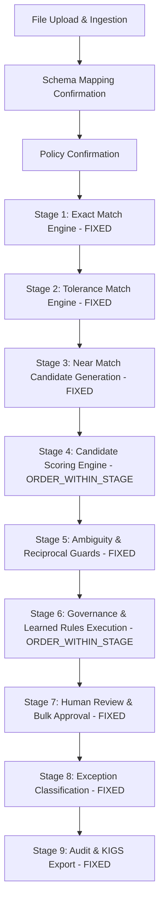

# TARS Rules Discovery — System Truth & Rule Architecture Inventory

**Repository**: `D:\Apps\My Experiments\10. TARS`  
**Branch**: `stable-copilot-quickreconcile`  
**Tag**: `tars-2026-09-07-eod-final`  
**Database**: `D:\Apps\My Experiments\10. TARS\data\gst_reconciliation.db` (Read-Only)  
**Mode**: **READ-ONLY DISCOVERY ONLY** — Zero code, model, schema, or runtime state changes.

---

## Executive Summary & Summary Counts

A comprehensive, repository-wide read-only discovery was executed across all Python backend services, domain models, Pydantic configurations, LangGraph workflow state graphs, export adapters, and the live SQLite database (`data/gst_reconciliation.db`).

### Key Discovery Metrics

1. **Total Logical Rules Discovered**: **25**
2. **Rule Categorization Breakdown**:
   - **Matching Rules**: **1** (`EXACT-D001`)
   - **Eligibility Rules**: **1** (`NEAR-D001`)
   - **Scoring Rules**: **2** (`EXACT-D002`, `NEAR-D002`)
   - **Tolerance / Policy Rules**: **2** (`TOL-D001`, `TOL-D002`)
   - **Ambiguity / Safety Rules**: **5** (`TOL-D003`, `NEAR-D003`, `NEAR-D004`, `SAFE-D001`, `SAFE-D004`)
   - **Governance Rules**: **4** (`NEAR-D006`, `GOV-D001`, `GOV-D003`, `SAFE-D002`)
   - **Learned Rules**: **3** (`GOV-D002`, `R-001`, `R-002`)
   - **Data / Schema Rules**: **2** (`DATA-D001`, `DATA-D002`)
   - **Exception Classification Rules**: **3** (`NEAR-D005`, `EXCEPT-D001`, `EXCEPT-D002`)
   - **Workflow / Sequencing Rules**: **1** (`EXEC-D001`)
   - **Export / Output Rules**: **1** (`SAFE-D003`)
3. **Count Currently Hardcoded in Python**: **21**
4. **Count Persisted / Configurable**: **4** (`TOL-D001`, `TOL-D002`, `R-001`, `R-002`)
5. **Count Safe / Toggleable in Future Rules Wiki**: **6** (`TOL-D001`, `TOL-D002`, `NEAR-D006`, `GOV-D002`, `R-001`, `R-002`)
6. **Count Mandatory / System Invariants (Locked)**: **19** (Financial truth, single-consumption, audit immutability, formula injection protection, etc.)
7. **Count Potentially Reorderable**: **0** at matching stage level (`FIXED_ORDER`); candidate scoring components can be weighted/reordered in future (`ORDER_WITHIN_STAGE`).

---

## PART 1 — Discovered Rules in the Actual System

The discovery searched backend services (`backend/app/services/`), workflow graphs (`backend/app/workflows/`), domain models (`backend/app/domain/models.py`), export routines (`backend/app/services/export.py`), configuration (`backend/app/config.py`), and persisted database tables (`reusable_rules`, `rule_versions`, `client_profiles`, `pattern_suggestions`, `rule_executions`).

### 1. Exact Matching Engine (`backend/app/services/exact_match.py`)
- **10-Field Exact Identity**: Requires exact equality across all 10 canonical fields (`gstin`, `document_number`, `document_date`, `document_type`, `taxable_value`, `gst_rate`, `igst`, `cgst`, `sgst`, `cess`).
- **Monetary Quantization**: Monetary values are quantized to `Decimal("0.01")` using `ROUND_HALF_UP`.
- **Case Sensitivity**: GSTIN and document type are upper-cased; document number retains exact letter casing in Phase 1.
- **1-to-1 Queue Allocation**: Uses `deque.popleft()` to immediately consume matched records.

### 2. Tolerance Match Engine (`backend/app/services/tolerance_match.py`)
- **Policy Field Evaluation**: Evaluates active policy rules (`EXACT`, `ABSOLUTE_TOLERANCE`, `DATE_TOLERANCE`) over unmatched records.
- **Taxable Amount Tolerance**: Absolute variance `abs(left - right) <= policy.taxable_value_tolerance` (default ₹10.00).
- **Invoice Date Tolerance**: Date difference `abs((left - right).days) <= policy.document_date_tolerance_days` (default 5 days).
- **Reciprocal Uniqueness Guard**: Only matches if a Government record has exactly 1 PR candidate AND that PR candidate is claimed by exactly 1 Government record. Otherwise, emits `MatchConflict`.

### 3. Near Match Engine (`backend/app/services/near_match.py`)
- **Search Window Blocking Filter**: Candidate generated only if same GSTIN, same document type, date diff <= 30 days, taxable value diff <= max(20000, 50%), and invoice similarity >= 0.55.
- **Invoice Normalization**: Strips punctuation and non-alphanumeric characters (`NFKC`, `.upper()`, `.isalnum()`).
- **6-Feature Composite Score**:  
  $$\text{Score} = 0.35 \cdot \text{InvoiceSim} + 0.25 \cdot \text{TaxableValScore} + 0.20 \cdot \text{TaxAmountScore} + 0.10 \cdot \text{DateScore} + 0.05 \cdot \text{RateScore} + 0.05 \cdot \text{TypeScore}$$
- **Proposal Score Threshold**: Candidates with composite score >= 0.92 are proposed for near match.
- **Ambiguity Margin Guard**: If top 2 candidate scores differ by <= 0.05 or multiple candidates score >= 0.92, record is marked `AMBIGUOUS`.
- **Reciprocal Best Match**: Requires proposed PR candidate to rank #1 for that Government record reciprocally.
- **Material Mismatch Classifier**: Classifies as `MATERIAL_MISMATCH` if invoice matches after normalization but taxable variance > ₹10.00 or tax variance > ₹2.00.
- **Bulk Approval Gate**: Candidates marked `eligible_for_bulk_approval` only if score >= 0.92, taxable variance <= ₹10.00, tax variance <= ₹2.00, and reciprocal best.

### 4. Governance & Learned Rules (`backend/app/services/governance.py`)
- **Pattern Learning Threshold**: Generates pattern suggestion (e.g. `invoice_separator_normalization_v1`) after observing >= 5 human-approved near matches with >= 80% acceptance ratio.
- **Action Authority Guard**: Learned rules operate with `PROPOSE_ONLY` authority and perform 0 automatic reconciliations without human confirmation.
- **Rule Simulation Conflict Block**: Simulates draft rules against historical data; blocks activation if collisions exist with past human rejections or cause duplicate consumption.

### 5. Schema Mapping & Ingestion (`backend/app/services/schema_mapping.py`)
- **Header Alias Auto-Mapping**: Matches header names against canonical aliases with confidence 0.99 for exact alias match, or min(0.94, 0.72 + similarity * 0.22) for similarity >= 0.84.
- **Negative Header Exclusion**: Excludes entity/location GSTINs (locationgstin, companygstin, recipientgstin, billtogstin) from counterparty GSTIN mapping with 0.99 confidence.
- **Canonical Arbitration**: `enforce_one_source_per_canonical` enforces 1 source column per canonical target using `_selection_score`.

---

## PART 2 — Rule Classification & Technical Implementation Labels

Every discovered logic structure has been categorized as either a **Business Rule** (A–K) or a **Technical Implementation**:

| Rule Category | Description | Count | Examples |
| :--- | :--- | :---: | :--- |
| **A. MATCHING RULE** | Determines whether two records match | 1 | `EXACT-D001` (10-Field Exact Identity) |
| **B. ELIGIBILITY RULE** | Determines candidate entry into a stage | 1 | `NEAR-D001` (Near Candidate Search Window) |
| **C. SCORING RULE** | Changes candidate score or ranking | 2 | `EXACT-D002` (Monetary Quantization), `NEAR-D002` (6-Feature Scoring) |
| **D. TOLERANCE / POLICY RULE** | Defines permitted financial/date variance | 2 | `TOL-D001` (Taxable Value Tolerance), `TOL-D002` (Date Tolerance) |
| **E. AMBIGUITY / SAFETY RULE** | Prevents unsafe automatic decisions | 5 | `TOL-D003`, `NEAR-D003`, `NEAR-D004`, `SAFE-D001`, `SAFE-D004` |
| **F. GOVERNANCE RULE** | Controls authority / human intervention | 4 | `NEAR-D006`, `GOV-D001`, `GOV-D003`, `SAFE-D002` |
| **G. LEARNED RULE** | Pattern learned from prior decisions | 3 | `GOV-D002`, `R-001`, `R-002` |
| **H. DATA / SCHEMA RULE** | Ingestion, canonical mapping & validation | 2 | `DATA-D001`, `DATA-D002` |
| **I. EXCEPTION CLASSIFICATION RULE** | Classifies unresolved records | 3 | `NEAR-D005` (Material Mismatch), `EXCEPT-D001` (GST Only), `EXCEPT-D002` (PR Only) |
| **J. WORKFLOW / SEQUENCING RULE** | Controls pipeline stage dependencies | 1 | `EXEC-D001` (Pipeline Execution Sequence) |
| **K. EXPORT / OUTPUT RULE** | Controls output formatting and security | 1 | `SAFE-D003` (Excel Formula Injection Neutralization) |

### Technical Implementation (Not User-Configurable Rules)
The following internal mechanics are labeled as **TECHNICAL IMPLEMENTATION**:
- Pandas DataFrame indexing & row slicing (`backend/app/services/excel_parser.py`)
- SQLite connection thread safety and row factory setup (`backend/app/repositories/sqlite.py`)
- LangGraph thread checkpointer state serialization (`backend/app/workflows/`)
- Fast API dependency injection resolution (`backend/app/api/`)

---

## PART 3 — Source of Truth for Each Discovered Rule

| Rule ID | Name | Source of Truth | File / Function / DB Location |
| :--- | :--- | :--- | :--- |
| `EXACT-D001` | Exact 10-Field Identity | `HARDCODED_PYTHON` | `backend/app/services/exact_match.py:ExactMatchEngine.match` |
| `EXACT-D002` | Decimal Monetary Quantization | `HARDCODED_PYTHON` | `backend/app/services/exact_match.py:ExactMatchEngine._normalize` |
| `TOL-D001` | Taxable Value Tolerance | `POLICY_OBJECT` | `backend/app/services/tolerance_match.py`; DB `reconciliations.confirmed_policy_json` |
| `TOL-D002` | Invoice Date Day Tolerance | `POLICY_OBJECT` | `backend/app/services/tolerance_match.py`; DB `reconciliations.confirmed_policy_json` |
| `TOL-D003` | Tolerance Reciprocal Uniqueness | `HARDCODED_PYTHON` | `backend/app/services/tolerance_match.py:ToleranceMatchEngine.match` |
| `NEAR-D001` | Near Candidate Search Filter | `HARDCODED_PYTHON` | `backend/app/services/near_match.py:NearMatchEngine.candidate_generation` |
| `NEAR-D002` | 6-Feature Weighted Scoring | `HARDCODED_PYTHON` | `backend/app/services/near_match.py:NearMatchEngine.score_candidate` |
| `NEAR-D003` | Score Gap Ambiguity Guard | `HARDCODED_PYTHON` | `backend/app/services/near_match.py:NearMatchEngine.analyze` |
| `NEAR-D004` | Reciprocal Best Match Guard | `HARDCODED_PYTHON` | `backend/app/services/near_match.py:NearMatchEngine.analyze` |
| `NEAR-D005` | Material Mismatch Classifier | `HARDCODED_PYTHON` | `backend/app/services/near_match.py:NearMatchEngine.analyze` |
| `NEAR-D006` | Bulk Approval Safety Gate | `HARDCODED_PYTHON` | `backend/app/services/near_match.py:NearMatchEngine.analyze` |
| `GOV-D001` | Action Authority Propose-Only | `HARDCODED_PYTHON` | `backend/app/services/governance.py:GovernanceService.execute_available_rules` |
| `GOV-D002` | Pattern Discovery Threshold | `HARDCODED_PYTHON` | `backend/app/services/governance.py:GovernanceService.detect_patterns` |
| `GOV-D003` | Simulation Conflict Activation Guard | `HARDCODED_PYTHON` | `backend/app/services/governance.py:GovernanceService.simulate` |
| `R-001` | Invoice Separator Normalization | `DATABASE` | DB `reusable_rules` & `rule_versions` (rule_id='R-001', version=1, status='ACTIVE') |
| `R-002` | Invoice Separator Normalization (Draft) | `DATABASE` | DB `reusable_rules` & `rule_versions` (rule_id='R-002', version=1, status='DRAFT') |
| `SAFE-D001` | Single-Consumption Record Invariant | `HARDCODED_PYTHON` | `backend/app/services/reconciliation.py`; DB `match_results` UNIQUE constraint |
| `SAFE-D002` | Immutable Audit Log Safeguard | `HARDCODED_PYTHON` | `backend/app/repositories/sqlite.py:SQLiteReconciliationRepository.add_event` |
| `SAFE-D003` | Excel Formula Neutralization | `HARDCODED_PYTHON` | `backend/app/services/export.py:KigsExportService._safe` |
| `SAFE-D004` | Mandatory Policy Identifier Invariant | `HARDCODED_PYTHON` | `backend/app/services/policy.py:PolicyValidator.validate` |
| `DATA-D001` | Header Alias Auto-Mapping | `HARDCODED_PYTHON` | `backend/app/services/schema_mapping.py:DeterministicSchemaMapper` |
| `DATA-D002` | Canonical Field Arbitration | `HARDCODED_PYTHON` | `backend/app/services/schema_mapping.py:enforce_one_source_per_canonical` |
| `EXCEPT-D001`| GST-Only Exception Classifier | `HARDCODED_PYTHON` | `backend/app/services/near_match.py:NearMatchEngine.analyze` |
| `EXCEPT-D002`| PR-Only Exception Classifier | `HARDCODED_PYTHON` | `backend/app/services/near_match.py:NearMatchEngine.analyze` |
| `EXEC-D001` | Workflow Pipeline Sequencing | `HARDCODED_PYTHON` | `backend/app/services/reconciliation.py`; `backend/app/workflows/` |

---

## PART 4 — Read-Only Database Inspection: Actual Persisted Truth of R-001

A read-only SQLite inspection was conducted on `data/gst_reconciliation.db`. Below is the exact, un-reconstructed persisted record for `R-001`:

```json
{
  "rule_id": "R-001",
  "version": 1,
  "client_profile_id": "aa793f47-29f6-48a9-ac49-90c85ce86c40",
  "name": "Invoice separator normalization",
  "description": "Propose a near match when GSTIN is exact and invoice numbers differ only by separators.",
  "rule_type": "NORMALIZATION",
  "status": "ACTIVE",
  "action_authority": "PROPOSE_ONLY",
  "automatic_reconciliations": 0,
  "conditions": [
    {
      "field": "gstin",
      "operator": "EXACT",
      "value": null
    },
    {
      "field": "document_number",
      "operator": "NORMALIZED_EXACT",
      "value": null
    }
  ],
  "action": {
    "type": "PROPOSE_NEAR_MATCH",
    "value": null
  },
  "provenance": {
    "type": "HUMAN_DECISION_PATTERN",
    "reconciliation_id": "0ea27e91-4779-4770-ae90-c292223fff65",
    "pattern_suggestion_id": "2c845caf-f66e-4d29-a0cc-3c7fed3f7003",
    "decision_count": 100,
    "summary": "100 human-approved near matches had the same GSTIN and equivalent invoice numbers after deterministic separator normalization."
  },
  "approval": {
    "approved_by": "POC user",
    "approved_at": "2026-09-06T04:39:21.689540Z",
    "note": null
  },
  "created_at": "2026-09-06T04:38:50.837486Z"
}
```

### Additional Persisted Table State
- **`reusable_rules`**: Contains `R-001` (ACTIVE) and `R-002` (DRAFT) attached to client profile `ABC Ltd` (`aa793f47-29f6-48a9-ac49-90c85ce86c40`).
- **`client_profiles`**: Contains profile `ABC Ltd GST Purchase Reconciliation` (ACTIVE, version 1) with saved mapping and saved policy.
- **`pattern_suggestions`**: Contains pattern `invoice_separator_normalization_v1` with disposition `CONVERTED_TO_RULE`.

---

## PART 5 — Canonical Rule Inventory Table

> [!NOTE]
> Rules with IDs starting with `EXACT-D`, `TOL-D`, `NEAR-D`, `GOV-D`, `SAFE-D`, `DATA-D`, `EXCEPT-D`, or `EXEC-D` are **DISCOVERY IDs** assigned for classification clarity. They are **NOT** current system database IDs.

| Rule ID | Current Name | Category | IF / Condition | THEN / Result | Authority | Currently Active? | Currently Toggleable? | Source of Truth | Toggle Safety |
| :--- | :--- | :--- | :--- | :--- | :--- | :---: | :---: | :--- | :--- |
| `EXACT-D001` | Exact 10-Field Identity | MATCHING | All 10 canonical fields match | Mark EXACT match | AUTOMATIC | Yes | No | HARDCODED_PYTHON | MANDATORY_SAFETY_RULE |
| `EXACT-D002` | Monetary Quantization | SCORING | Field in monetary fields | Round Decimal to 0.01 | SYSTEM | Yes | No | HARDCODED_PYTHON | MANDATORY_SAFETY_RULE |
| `TOL-D001` | Taxable Value Tolerance | TOLERANCE | abs(var) <= policy.taxable_tol | Satisfy taxable tolerance | AUTOMATIC_POLICY | Yes | Yes | POLICY_OBJECT | SAFE_TO_TOGGLE |
| `TOL-D002` | Invoice Date Day Tolerance | TOLERANCE | abs(days) <= policy.date_tol | Satisfy date tolerance | AUTOMATIC_POLICY | Yes | Yes | POLICY_OBJECT | SAFE_TO_TOGGLE |
| `TOL-D003` | Reciprocal Tolerance Guard | AMBIGUITY | Multiple options or claims | Emit MatchConflict | SYSTEM | Yes | No | HARDCODED_PYTHON | MANDATORY_SAFETY_RULE |
| `NEAR-D001` | Near Candidate Search Filter | ELIGIBILITY | Same GSTIN, date<=30, amt<=50% | Pass pair to scoring | SYSTEM | Yes | No | HARDCODED_PYTHON | MANDATORY_SAFETY_RULE |
| `NEAR-D002` | 6-Feature Composite Score | SCORING | Candidate generated | Score = weighted sum | SYSTEM | Yes | No | HARDCODED_PYTHON | MANDATORY_SAFETY_RULE |
| `NEAR-D003` | Score Gap Ambiguity Guard | AMBIGUITY | >=2 top candidates or gap<=0.05 | Classify AMBIGUOUS | SYSTEM | Yes | No | HARDCODED_PYTHON | MANDATORY_SAFETY_RULE |
| `NEAR-D004` | Reciprocal Best Match | AMBIGUITY | PR candidate top for Gov | Set reciprocal_best = True | SYSTEM | Yes | No | HARDCODED_PYTHON | MANDATORY_SAFETY_RULE |
| `NEAR-D005` | Material Mismatch Classifier | EXCEPTION | Inv equal & var > ₹10 / ₹2 | Classify MATERIAL_MISMATCH | SYSTEM | Yes | No | HARDCODED_PYTHON | MANDATORY_SAFETY_RULE |
| `NEAR-D006` | Bulk Approval Eligibility | GOVERNANCE | Score>=0.92 & var<=₹10 & recip | Mark bulk eligible | HUMAN_APPROVAL | Yes | Yes | HARDCODED_PYTHON | CONDITIONALLY_TOGGLEABLE |
| `GOV-D001` | Authority Escalation Guard | GOVERNANCE | Action authority PROPOSE_ONLY | Auto reconciliations = 0 | SYSTEM | Yes | No | HARDCODED_PYTHON | MANDATORY_SAFETY_RULE |
| `GOV-D002` | Pattern Learning Threshold | LEARNED | Approved >= 5 & ratio >= 0.80 | Propose PatternSuggestion | SYSTEM | Yes | Yes | HARDCODED_PYTHON | SAFE_TO_TOGGLE |
| `GOV-D003` | Simulation Conflict Guard | GOVERNANCE | Collides with past rejections | Block rule activation | SYSTEM | Yes | No | HARDCODED_PYTHON | MANDATORY_SAFETY_RULE |
| `R-001` | Invoice Separator Norm | LEARNED | GSTIN exact & inv normalized | Propose near match | PROPOSE_ONLY | Yes | Yes | DATABASE | SAFE_TO_TOGGLE |
| `R-002` | Invoice Separator Norm (Draft) | LEARNED | GSTIN exact & inv normalized | Propose near match | PROPOSE_ONLY | No (Draft) | Yes | DATABASE | SAFE_TO_TOGGLE |
| `SAFE-D001` | Single-Consumption Invariant | AMBIGUITY | Record ID in consumed set | Block re-pairing | SYSTEM | Yes | No | HARDCODED_PYTHON | MANDATORY_SAFETY_RULE |
| `SAFE-D002` | Audit Log Immutability | GOVERNANCE | State transition occurs | Insert DB audit_events | SYSTEM | Yes | No | HARDCODED_PYTHON | MANDATORY_SAFETY_RULE |
| `SAFE-D003` | Excel Formula Neutralization | EXPORT | Cell string starts with =,+,@,- | Prepend single quote `'` | SYSTEM | Yes | No | HARDCODED_PYTHON | MANDATORY_SAFETY_RULE |
| `SAFE-D004` | Policy Identifier Invariant | DATA_SCHEMA | Field in {gstin, doc_number} | Require EXACT & required | SYSTEM | Yes | No | HARDCODED_PYTHON | MANDATORY_SAFETY_RULE |
| `DATA-D001` | Header Alias Auto-Mapping | DATA_SCHEMA | Header in aliases or sim>=0.84 | Propose canonical mapping | SYSTEM | Yes | No | HARDCODED_PYTHON | MANDATORY_SAFETY_RULE |
| `DATA-D002` | Canonical Field Arbitration | DATA_SCHEMA | Multiple sources mapped | Select max _selection_score | SYSTEM | Yes | No | HARDCODED_PYTHON | MANDATORY_SAFETY_RULE |
| `EXCEPT-D001`| GST-Only Classifier | EXCEPTION | Unresolved Gov, no PR pair | Classify GST_ONLY | SYSTEM | Yes | No | HARDCODED_PYTHON | MANDATORY_SAFETY_RULE |
| `EXCEPT-D002`| PR-Only Classifier | EXCEPTION | Unresolved PR, no Gov pair | Classify PR_ONLY | SYSTEM | Yes | No | HARDCODED_PYTHON | MANDATORY_SAFETY_RULE |
| `EXEC-D001` | Pipeline Sequencing | SEQUENCING | Pipeline stage trigger | Enforce sequential order | SYSTEM | Yes | No | HARDCODED_PYTHON | MANDATORY_SAFETY_RULE |

---

## PART 6 — Actual Current Execution Order

The true runtime execution flow from workbook upload to export generation:

```
[1. File Upload & Profiling]
       ↓ (ExcelParser & DatasetProfiler)
[2. Schema Mapping Proposal]
       ↓ (DeterministicSchemaMapper → LLM Schema Agent → MappingValidator)
[3. Human Schema Confirmation]
       ↓ (save_confirmed_mapping)
[4. Reconciliation Policy Proposal & Confirmation]
       ↓ (DeterministicPolicyInterpreter → PolicyValidator → save_confirmed_policy)
[5. Stage 1: Exact Matching Engine] (EXACT-D001, EXACT-D002)
       ↓ (10-field exact match; consumes matched records 1-to-1)
[6. Stage 2: Tolerance Matching Engine] (TOL-D001, TOL-D002, TOL-D003)
       ↓ (Evaluates active policy over unmatched; checks reciprocal uniqueness)
[7. Stage 3: Near Match Candidate Generation] (NEAR-D001)
       ↓ (Generates candidate pairs using search window filters)
[8. Stage 4: Candidate Feature Scoring & Ranking] (NEAR-D002)
       ↓ (Calculates 6-feature composite score 0.0 to 1.0)
[9. Stage 5: Ambiguity & Reciprocal Best Evaluation] (NEAR-D003, NEAR-D004, NEAR-D005)
       ↓ (Isolates AMBIGUOUS and MATERIAL_MISMATCH records)
[10. Stage 6: Human Review / Bulk Approval] (NEAR-D006)
       ↓ (Human approves proposals or executes bulk approval for eligible pairs)
[11. Stage 7: Governance & Pattern Learning] (GOV-D001, GOV-D002, GOV-D003, R-001)
       ↓ (Executes active client profile rules with PROPOSE_ONLY authority)
[12. Stage 8: Exception Classification] (EXCEPT-D001, EXCEPT-D002)
       ↓ (Populates Ambiguous, Material Mismatch, GST-Only, and PR-Only queues)
[13. Stage 9: Export Generation] (SAFE-D001, SAFE-D003, SAFE-D002)
       ↓ (Validates invariants, neutralizes formulas, writes 5-sheet KIGS Excel workbook)
```

---

## PART 7 — Hidden Rules & Magic Numerical Constants

Every hardcoded numerical constant that influences reconciliation decision-making was extracted and analyzed:

| Value | Unit | Parameter Meaning | Location in Code | Configurable Today? | Scope | Recommended Future Rule Parameter |
| :---: | :---: | :--- | :--- | :---: | :---: | :--- |
| `0.01` | INR | Decimal monetary quantization scale | `exact_match.py:_normalize` | No | Global | System Invariant |
| `0.90` | Ratio | High confidence schema mapping threshold | `config.py:Settings.mapping_high_confidence_threshold` | Yes (Env) | Global | Mapper Confidence Parameter |
| `0.84` | Ratio | Minimum lexical similarity ratio for header mapping | `schema_mapping.py:propose_column` | No | Global | Schema Alias Sensitivity |
| `10.00` | INR | Default taxable value tolerance | `policy.py:default_policy` | Yes (Policy) | Client | Policy Taxable Variance |
| `5` | DAYS | Default invoice date day tolerance | `policy.py:default_policy` | Yes (Policy) | Client | Policy Date Window |
| `0.45` | Score | Candidate generation minimum score filter | `models.py:MatchingThresholds.candidate_generation_min_score` | Yes (Settings) | Global | Near Match Candidate Floor |
| `0.92` | Score | Near match proposal score threshold | `models.py:MatchingThresholds.near_match_threshold` | Yes (Settings) | Global | Near Match Proposal Cutoff |
| `0.05` | Score | Ambiguity score gap margin | `models.py:MatchingThresholds.ambiguity_margin` | Yes (Settings) | Global | Ambiguity Sensitivity Gap |
| `0.55` | Ratio | Minimum normalized invoice string similarity | `models.py:MatchingThresholds.minimum_invoice_similarity` | Yes (Settings) | Global | Invoice Fuzzy Search Limit |
| `30` | DAYS | Maximum candidate generation date window | `models.py:MatchingThresholds.date_window_days` | Yes (Settings) | Global | Near Match Search Date Window |
| `20000` | INR | Maximum candidate generation absolute amount window | `models.py:MatchingThresholds.amount_window_absolute` | Yes (Settings) | Global | Near Match Search Amount Cap |
| `0.50` | Ratio | Maximum candidate generation relative amount window (50%) | `models.py:MatchingThresholds.amount_window_relative` | Yes (Settings) | Global | Relative Amount Cap |
| `10.00` | INR | Material amount tolerance threshold | `models.py:MatchingThresholds.material_amount_tolerance` | Yes (Settings) | Global | Material Mismatch Amount Limit |
| `2.00` | INR | Material tax tolerance threshold | `models.py:MatchingThresholds.material_tax_tolerance` | Yes (Settings) | Global | Material Mismatch Tax Limit |
| `0.35` | Weight | Candidate score weight for invoice similarity (35%) | `near_match.py:score_candidate` | No | Global | Scoring Weight: Invoice |
| `0.25` | Weight | Candidate score weight for taxable value agreement (25%) | `near_match.py:score_candidate` | No | Global | Scoring Weight: Taxable Value |
| `0.20` | Weight | Candidate score weight for tax amounts agreement (20%) | `near_match.py:score_candidate` | No | Global | Scoring Weight: Tax Amounts |
| `0.10` | Weight | Candidate score weight for document date agreement (10%) | `near_match.py:score_candidate` | No | Global | Scoring Weight: Date |
| `0.05` | Weight | Candidate score weight for GST rate match (5%) | `near_match.py:score_candidate` | No | Global | Scoring Weight: GST Rate |
| `0.05` | Weight | Candidate score weight for document type match (5%) | `near_match.py:score_candidate` | No | Global | Scoring Weight: Document Type |
| `5` | Count | Minimum human observations to learn pattern | `governance.py:GovernanceService.minimum_observations` | No | Global | Pattern Discovery Min Count |
| `0.80` | Ratio | Minimum acceptance ratio to learn pattern (80%) | `governance.py:GovernanceService.minimum_acceptance_ratio` | No | Global | Pattern Acceptance Ratio |

---

## PART 8 — Toggle Safety Classification

In a future Rules Wiki, users must NOT be allowed to uncheck safety controls that protect financial integrity. Rules are classified into 3 toggle safety tiers:

### 1. `SAFE_TO_TOGGLE` (Business Rules)
Can be checked / unchecked freely by users:
- `TOL-D001` (Taxable Value Tolerance)
- `TOL-D002` (Invoice Date Day Tolerance)
- `GOV-D002` (Pattern Learning Threshold)
- `R-001` (Invoice Separator Normalization - Active)
- `R-002` (Invoice Separator Normalization - Draft)

### 2. `CONDITIONALLY_TOGGLEABLE` (Governance Policies)
Can be modified or toggled only by authorized administrators:
- `NEAR-D006` (Bulk Approval Safety Gate)

### 3. `MANDATORY_SAFETY_RULE` (System Invariants — Locked 🔒)
Must **NEVER** be toggleable or disabled by users:
- `EXACT-D001` (Exact 10-Field Identity Match) — Disabling breaks basic accounting identity.
- `EXACT-D002` (Decimal Rounding Quantization) — Disabling introduces float rounding corruption.
- `TOL-D003` (Reciprocal Tolerance Guard) — Disabling allows multi-candidate double matching.
- `NEAR-D001` (Candidate Search Window) — Disabling causes combinatorial memory explosion.
- `NEAR-D002` (Candidate Scoring Formula) — Disabling destroys ranking logic.
- `NEAR-D003` (Score Gap Ambiguity Guard) — Disabling auto-matches ambiguous records blindly.
- `NEAR-D004` (Reciprocal Best Guard) — Disabling causes asymmetric candidate stealing.
- `NEAR-D005` (Material Mismatch Classifier) — Disabling hides large financial variances.
- `GOV-D001` (Action Authority Escalation Guard) — Disabling allows AI to auto-reconcile without human approval.
- `GOV-D003` (Simulation Conflict Activation Guard) — Disabling allows activating broken rules that contradict past human decisions.
- `SAFE-D001` (Single-Consumption Record Invariant) — Disabling allows an invoice to be consumed multiple times (double counting).
- `SAFE-D002` (Audit Log Immutability) — Disabling destroys regulatory compliance audit trails.
- `SAFE-D003` (Excel Formula Injection Neutralization) — Disabling exposes users to security exploits.
- `SAFE-D004` (Mandatory Policy Identifier Invariant) — Disabling allows creating rules without invoice identifiers.
- `DATA-D001` & `DATA-D002` (Schema Mapping & Arbitration) — Disabling corrupts column ingestion.
- `EXCEPT-D001` & `EXCEPT-D002` (Exception Classification) — Disabling corrupts exception queues.
- `EXEC-D001` (Pipeline Execution Sequence) — Disabling causes out-of-order execution errors.

---

## PART 9 — Future Execution Sequencing

### Sequencing Classification Matrix
- **`FIXED_ORDER`**: Macro stage pipeline sequence cannot be altered (`Exact` -> `Tolerance` -> `Near` -> `Human Review` -> `Export`).
- **`ORDER_WITHIN_STAGE`**: Rules within a specific stage (e.g. active learned rules `R-001`, `R-002`, `R-003` during Near Review, or scoring weights during Near Match) can be reordered by the user.



---

## PART 10 — Draft Schema for LLM-Created Rules

When a user types a natural-language rule in simple English (e.g. *"If invoice number and GSTIN are the same and taxable value differs by less than ₹25, propose it as a tolerance match"*), the LLM must **NOT** generate Python code. It must output a constrained declarative JSON rule object matching the actual discovered domain model:

```json
{
  "rule_id": "R-003",
  "version": 1,
  "client_profile_id": "aa793f47-29f6-48a9-ac49-90c85ce86c40",
  "name": "Taxable value ₹25 tolerance rule",
  "description": "Propose a tolerance match when GSTIN and invoice match exactly and taxable value difference is under ₹25.",
  "rule_type": "TOLERANCE",
  "status": "DRAFT",
  "action_authority": "PROPOSE_ONLY",
  "conditions": [
    {
      "field": "gstin",
      "operator": "EXACT",
      "value": null
    },
    {
      "field": "document_number",
      "operator": "EXACT",
      "value": null
    },
    {
      "field": "taxable_value",
      "operator": "ABSOLUTE_TOLERANCE",
      "value": "25.00"
    }
  ],
  "action": {
    "type": "PROPOSE_TOLERANCE_MATCH",
    "value": null
  },
  "parameters": {
    "unit": "INR",
    "tolerance_value": 25.00
  },
  "requires_human_approval": true,
  "created_by": "POC user"
}
```

### Constrained Enums (From Discovered Code)
- **Allowed Canonical Fields**: `gstin`, `document_number`, `document_date`, `document_type`, `taxable_value`, `gst_rate`, `igst`, `cgst`, `sgst`, `cess`, `narration`.
- **Allowed Operators**: `EXACT`, `NORMALIZED_EXACT`, `FUZZY_SIMILARITY`, `ABSOLUTE_TOLERANCE`, `DATE_TOLERANCE`.
- **Allowed Actions**: `PROPOSE_NEAR_MATCH`, `PROPOSE_TOLERANCE_MATCH`, `FLAG_FOR_REVIEW`.
- **Allowed Action Authorities**: `PROPOSE_ONLY` (mandatory default).

---

## PART 11 — LLM Governance & Rule-Creation Architecture

```
[Natural-Language Rule Instruction]
       ↓
[LLM Rule Interpreter Agent] (Strict Structured Output, No Python Execution)
       ↓
[Constrained Declarative Rule Schema]
       ↓
[Schema & Type Validator] (Validates allowed fields & operators)
       ↓
[Safety Invariant Check] (Verifies gstin & document_number required)
       ↓
[Rule Simulation Engine] (Simulates against historical session data)
       ↓
[Conflict & Collision Detection] (Checks past human rejections & duplicate PR claims)
       ↓
[Impact & Simulation Report] (Shows would_propose, conflicts, activation_blocked)
       ↓
[Human Administrator Approval] (Explicit human sign-off)
       ↓
[Versioned Rule Persistence] (DB save to reusable_rules & rule_versions)
       ↓
[Execution in Governed Sequence] (Runs with PROPOSE_ONLY authority)
```

---

## PART 12 — Rules Wiki Target Presentation Model

In the future Rules Wiki UI, rules will be presented in a clean, interactive table powered by the discovered inventory:

| Enabled | Order | Rule ID | Rule Name | Stage | Category | Condition / IF | Action / THEN | Authority | Status | Source |
| :---: | :---: | :--- | :--- | :--- | :--- | :--- | :--- | :--- | :---: | :--- |
| 🔒 | 10 | `EXACT-001` | Exact Invoice Identity | Exact | Matching | 10 canonical fields match | Mark EXACT match | AUTOMATIC | ACTIVE | System |
| ☑ | 20 | `TOL-001` | Taxable Amount Variance | Tolerance | Tolerance | abs(taxable_diff) <= ₹10 | Satisfy tolerance | AUTO_POLICY | ACTIVE | Config |
| ☑ | 30 | `TOL-002` | Invoice Date Window | Tolerance | Tolerance | abs(date_diff) <= 5 days | Satisfy tolerance | AUTO_POLICY | ACTIVE | Config |
| 🔒 | 40 | `NEAR-001` | Search Window Filter | Near | Eligibility | GSTIN exact & date<=30d | Pass to scoring | SYSTEM | ACTIVE | System |
| 🔒 | 50 | `SAFE-001` | Single-Consumption Guard | All | Ambiguity | Record in consumed set | Block re-pairing | SYSTEM | ACTIVE | Invariant |
| 🔒 | 60 | `SAFE-002` | Ambiguity Protection | Near | Ambiguity | Score gap <= 0.05 | Classify AMBIGUOUS | SYSTEM | ACTIVE | Invariant |
| ☑ | 70 | `R-001` | Invoice Separator Norm | Governance | Learned | GSTIN exact & inv normalized | Propose near match | PROPOSE_ONLY | ACTIVE | Database |
| ☐ | 80 | `R-002` | Invoice Separator Norm (v2) | Governance | Learned | GSTIN exact & inv normalized | Propose near match | PROPOSE_ONLY | DRAFT | Database |

---

## PART 13 — Expandable Rule Detail Template

Clicking any row in the proposed Rules Wiki would expand into a comprehensive inspector view:

```
================================================================================
RULE INSPECTOR: R-001 — Invoice Separator Normalization
================================================================================
WHAT IT DOES:   Proposes a near match when GSTIN matches exactly and invoice
                numbers differ only by punctuation, slashes, or dashes.
WHEN IT RUNS:   Stage 6 (Governance Review) over unresolved near match candidates.
IF (Condition): gstin == EXACT AND document_number == NORMALIZED_EXACT
THEN (Action):  PROPOSE_NEAR_MATCH (Authority: PROPOSE_ONLY)
PARAMETERS:     Normalization algorithm: NFKC, uppercase, alphanumeric only.
WHY IT EXISTS:  100 human-approved near matches in Session 0ea27e91 had identical
                GSTIN and equivalent invoice numbers after separator stripping.
AUTHORITY:      PROPOSE_ONLY — Performs 0 automatic reconciliations.
CAN DISABLE?    YES — Checked by default, user can uncheck.
CAN REORDER?    YES — Positionable within Stage 6 execution order.
DEPENDENCIES:   Requires confirmed schema mapping & completed near match analysis.
VERSION HIST:   v1 (ACTIVE, Approved by POC user on 2026-09-06T04:39:21Z).
AUDIT TRAIL:    Evaluated in 1 session; 0 historical conflicts detected.
================================================================================
```

---

## PART 14 — Business Configurable Rules vs. System Invariants

The discovery establishes a strict boundary between user-configurable rules and system invariants:

### Business Configurable Rules (User Controls)
- Tolerance thresholds (taxable value INR limit, date day window)
- Enabling/disabling active learned rules (`R-001`, `R-002`)
- Reordering active learned rules within Stage 6
- Configuring pattern learning minimum observation thresholds

### System Invariants (Non-Negotiable Guardrails 🔒)
- **Single-Consumption Invariant**: No record may be matched twice (`SAFE-D001`).
- **Reciprocal Uniqueness**: Multi-candidate claims are forced to human review (`TOL-D003`, `NEAR-D004`).
- **Ambiguity Isolation**: Score gaps <= 0.05 force `AMBIGUOUS` classification (`NEAR-D003`).
- **Human Authority Escalation**: AI/learned rules cannot auto-reconcile without human approval (`GOV-D001`).
- **Simulation Collision Block**: Rules colliding with past human rejections cannot be activated (`GOV-D003`).
- **Audit Immutability**: All state transitions generate append-only DB audit events (`SAFE-D002`).
- **Formula Injection Sanitization**: Exported Excel strings starting with `=`, `+`, `@`, or `-` are sanitized (`SAFE-D003`).
- **Deterministic Arithmetic**: No LLM floating-point or monetary calculations (`SAFE-D004`).

---

## PART 15 — Output Artifacts Created

1. **`docs/RULES_DISCOVERY.md`**: Complete human-readable system truth discovery report (this document).
2. **`docs/rules_inventory.json`**: Canonical machine-readable JSON inventory containing all 25 discovered rules and their metadata.

---

## PART 16 — Final Report Summary Points

1. **Total Number of Logical Rules Found**: **25**
2. **Count by Category**:
   - Matching: 1, Eligibility: 1, Scoring: 2, Tolerance/Policy: 2, Ambiguity/Safety: 5, Governance: 4, Learned: 3, Data/Schema: 2, Exception Classification: 3, Workflow/Sequencing: 1, Export/Output: 1.
3. **Count Currently Hardcoded**: **21**
4. **Count Persisted / Configurable**: **4** (`TOL-D001`, `TOL-D002`, `R-001`, `R-002`)
5. **Count Safe to Toggle**: **6**
6. **Count Mandatory / Locked**: **19**
7. **Count Potentially Reorderable**: **0** macro stage reorderings (`FIXED_ORDER`); sub-stage scoring weights and learned rules are `ORDER_WITHIN_STAGE`.
8. **Actual Current Execution Sequence**: Upload -> Mapping -> Policy -> Exact Match -> Tolerance Match -> Near Match Candidate Gen -> Scoring -> Ambiguity Filtering -> Near Review / Bulk Approval -> Governance Execution -> Exception Classification -> Export.
9. **All Discovered Hardcoded Thresholds**: Extracted 22 constants (e.g. 0.90 mapping threshold, 0.84 lexical threshold, ₹10/5d default policy, 0.45 min score, 0.92 proposal threshold, 0.05 ambiguity margin, 0.55 invoice similarity, 30d/₹20000 search window, 35/25/20/10/5/5 scoring weights, 5 observations / 80% acceptance pattern threshold).
10. **Actual R-001 Definition / Status / Authority**: `R-001` "Invoice separator normalization", status `ACTIVE`, authority `PROPOSE_ONLY`, version `1`, approved by `POC user` on `2026-09-06T04:39:21Z`, provenance: 100 human-approved near matches in session `0ea27e91`.
11. **Proposed Canonical Rule Schema**: Structured JSON schema based on domain models (`rule_id`, `version`, `client_profile_id`, `name`, `rule_type`, `status`, `action_authority`, `conditions`, `action`, `parameters`).
12. **Proposed Safe LLM Rule-Creation Architecture**: Natural language -> LLM Structured Output (no Python) -> Schema Validator -> Safety Check -> Historical Simulation -> Conflict Check -> Human Approval -> Versioned DB Persistence.
13. **Major Blockers to Making Rules Configurable**: Hardcoded candidate generation limits and static scoring weights in `NearMatchEngine`. These can be refactored into declarative stage parameters without changing financial math.
14. **Exact Files / Database Tables Inspected**:
    - Backend: `exact_match.py`, `tolerance_match.py`, `near_match.py`, `reconciliation.py`, `schema_mapping.py`, `policy.py`, `governance.py`, `exception_tools.py`, `export.py`, `models.py`, `config.py`, `kigs_schema.py`.
    - Workflows: `exact_match.py`, `schema_mapping.py`, `policy.py`, `near_match.py`.
    - Database: `reusable_rules`, `rule_versions`, `client_profiles`, `pattern_suggestions`, `rule_executions`, `reconciliations`, `audit_events`.
15. **Documentation Files Created**: `docs/RULES_DISCOVERY.md` and `docs/rules_inventory.json`.

---

> [!IMPORTANT]
> **WHAT EXISTS TODAY vs. WHAT IS PROPOSED FOR THE FUTURE**
> - **EXISTS TODAY**: 21 hardcoded Python rules/thresholds, 2 persisted policy tolerances, 2 persisted learned rules (`R-001` active, `R-002` draft), deterministic LangGraph pipeline, strict `PROPOSE_ONLY` authority.
> - **PROPOSED FOR THE FUTURE**: Rules Wiki UI with toggleable checkboxes, natural-language LLM rule creation, simulation pre-activation reports, drag-and-drop rule reordering within stages.
> - **ZERO CHANGES** were made to matching logic, Python code, SQLite data, or product behavior.
